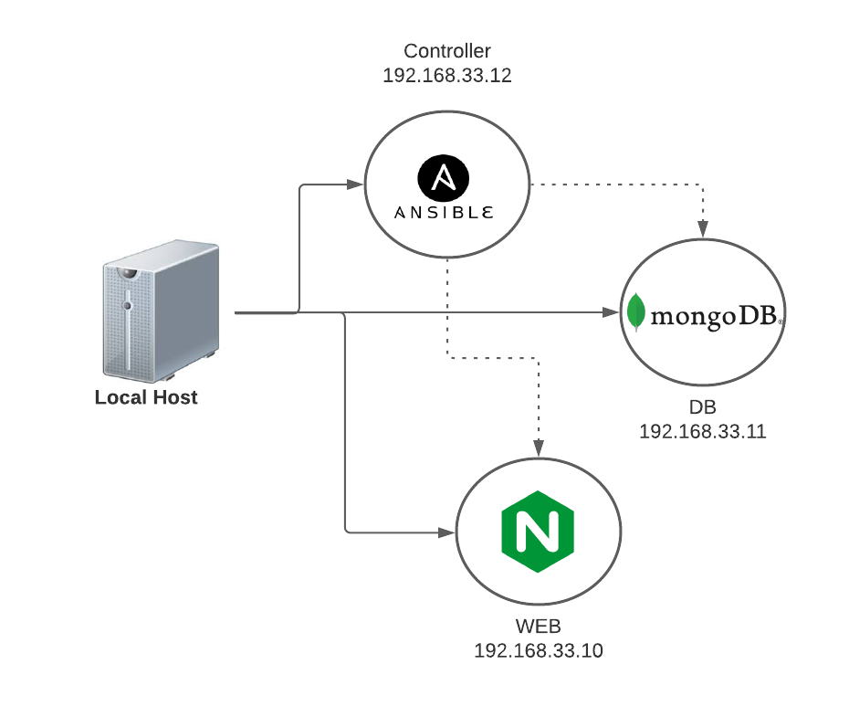

# IaC Ansible



## Prerequisites

- Vagrant
- Ruby
- Virtual Box

## Setting up Ansible

- On Terminal cd to `Vagrantfile` directory
- **vagrant up**
- It will take some and once its done you should see 3 machines running `vagrant status` 
  - controller
  - db
  -web


- SSH into controller machine
- `vagrant ssh controller`

```
sudo apt-get update
sudo apt-get upgrade -y

#Fix broken packages
sudo apt-get install software-properties-common

# Install Ansible
sudo apt-add-repository ppa:ansible/ansible
sudo apt-get install ansible -y
```
- `cd /etc/ansible`
- add following to the hosts file

```
[web]
192.168.33.10 ansible_connection=ssh ansible_ssh_user=vagrant ansible_ssh_pass=vagrant

[db]
192.168.33.10 ansible_connection=ssh ansible_ssh_user=vagrant ansible_ssh_pass=vagrant
```

### SSH into db/web from controller machine

- `ssh vagrant@192.168.33.10` (web machine)
- `ssh vagrant@192.168.33.11` (db machine)
- type *yes* and set password


- back in controller machine you can ping to test connection with your web/db machine

- type `ansible web -m ping`
